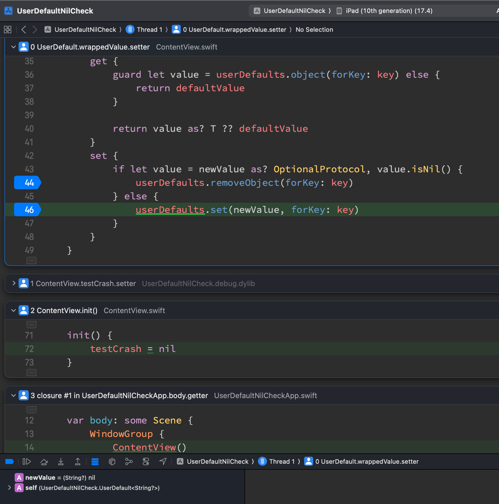
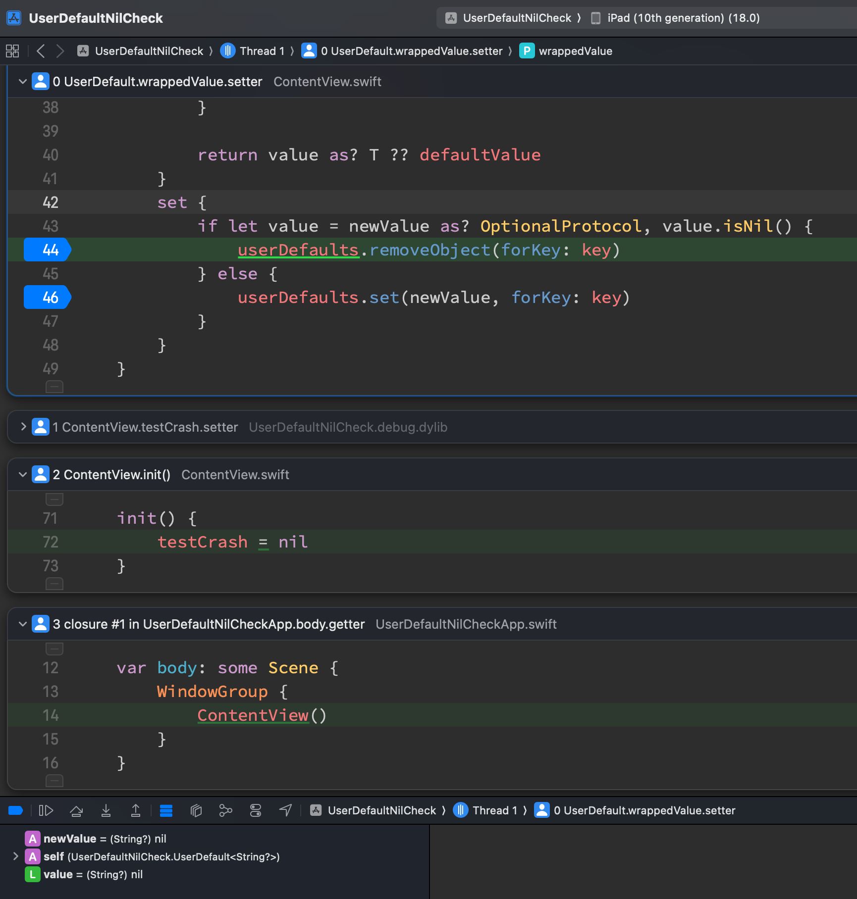

# The optional check seems broken on `Xcode 16` and `< iOS 18`

## Description

Previously, we use `Optional Protocol` to check a generic type is nil or not. After update to Xcode 16, the behavior seems weird. It condition broken < iOS 18 like the snapshots below:

As you can see, the console showing the value is nil but it didn't go to the right scope. If I adding a ` else if newValue == nil {}` it still not work.

## Snapshots

### Crash on iOS 17 with Xcode 16 beta 2 (same with beta 1)

### Work as before Xcode 15, on iOS 18

